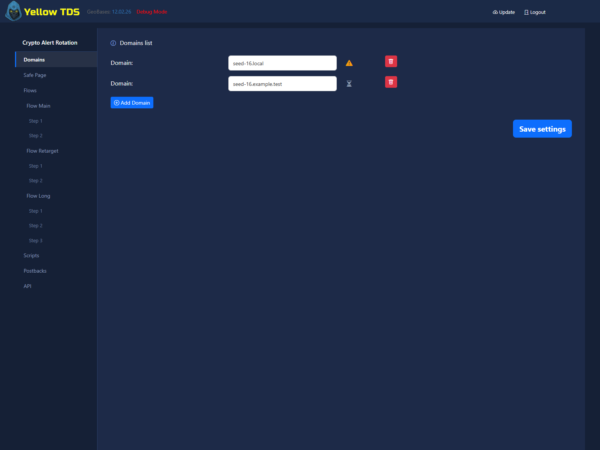
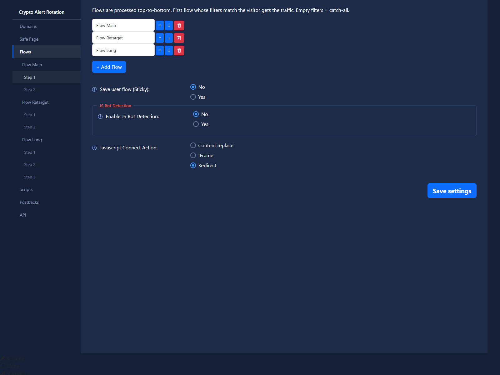

# Campaign Settings

## Main Sections

The campaign settings page includes:

- Domains
- White
- Flows
- Scripts
- Postbacks
- Statistics

## White

Defines what blocked or filtered traffic receives.

## Flows

Defines the black branch routing for allowed traffic.

## Statistics

Defines timezone, click-view columns, and custom statistics tables.
