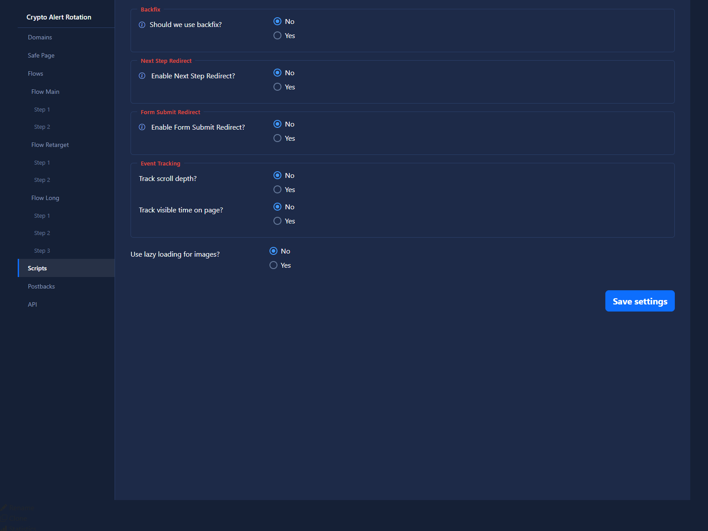

# Scripts

## Purpose

The Scripts section controls additional page and funnel behavior.

## Main Options

- backfix
- replace prelanding
- replace landing
- images lazy load
- redirect rules
- event tracking

