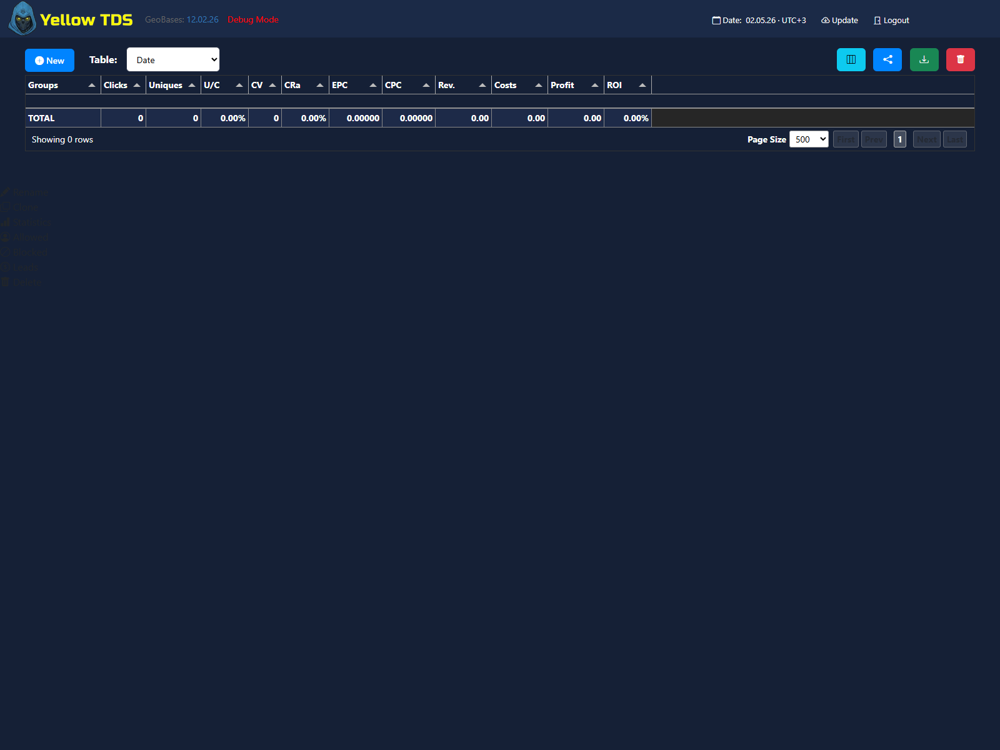
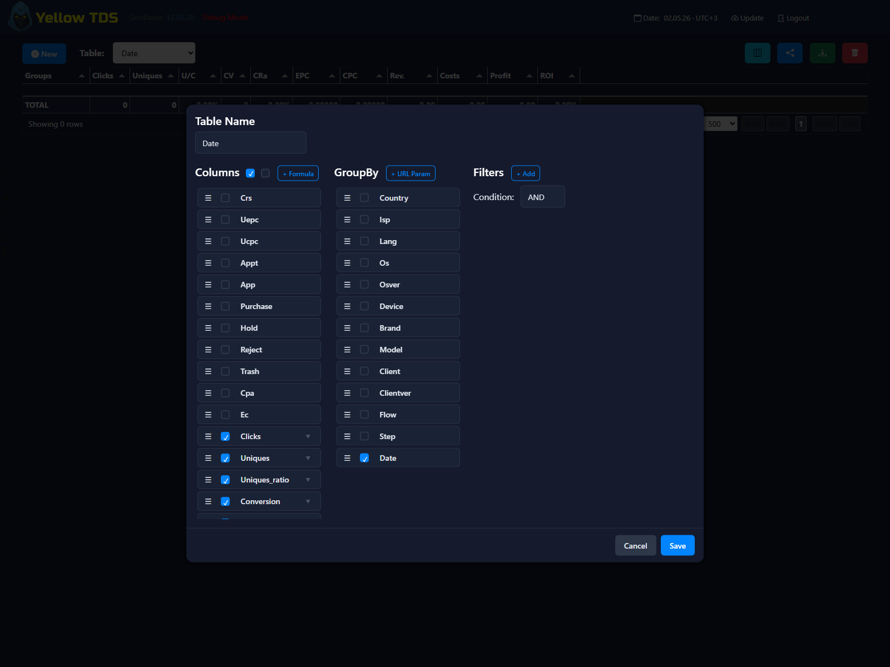

# Statistics

## Main Capabilities

Campaign statistics let you:

- create multiple saved tables
- configure columns
- configure group by
- save filters
- save order by
- export tables to XLSX

## Custom Metrics

Custom formula columns can use:

- base metrics
- event metrics
- derived metrics
