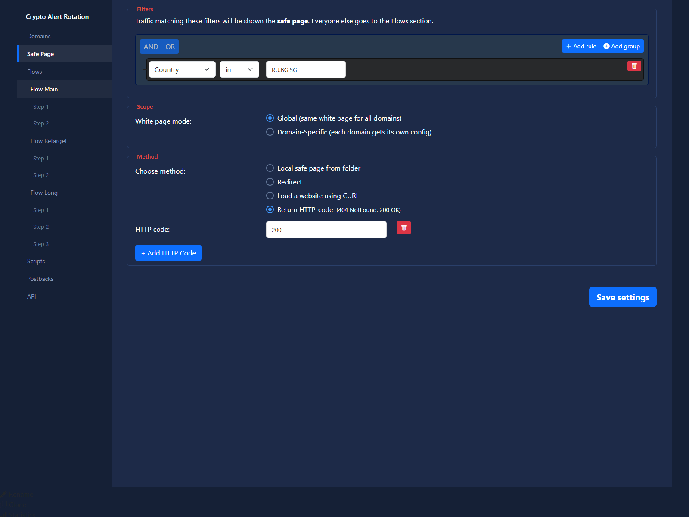

# White Settings

## Purpose

White settings define what to do with traffic that should not enter the black funnel.

## Available Actions

- local safe page from folder
- redirect
- load a website using CURL
- return HTTP code

