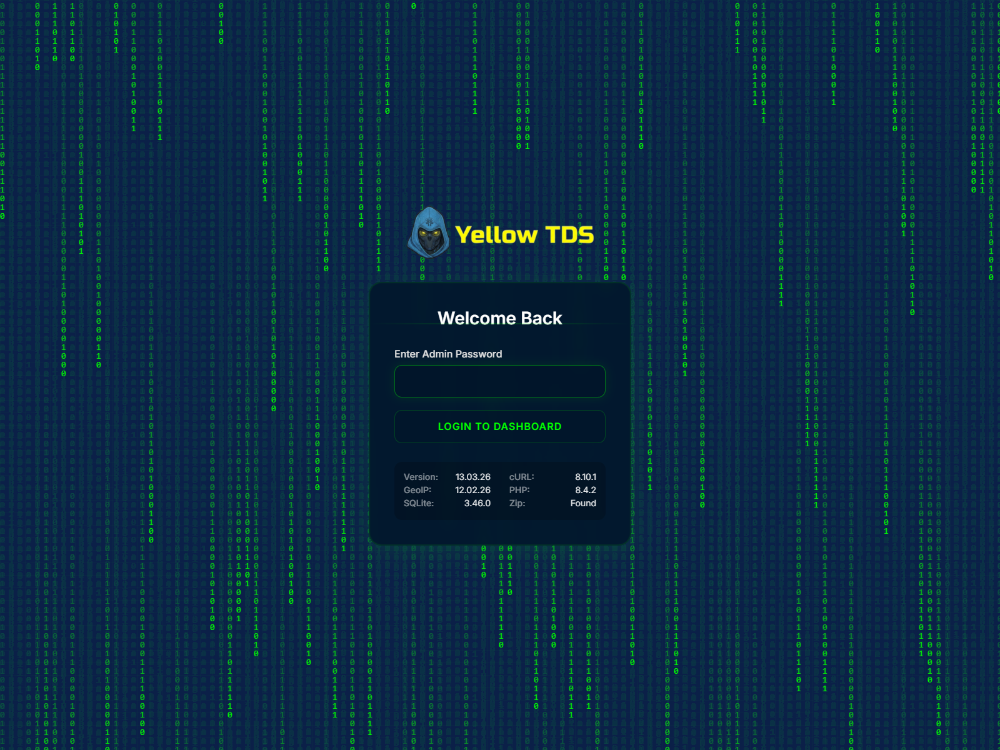

# Вход в админку

## Где находится админка

Основная точка входа:

- `/admin/`

Если открыть `/admin` без завершающего слэша, происходит редирект на корректный путь.

## Пароль

Пароль администратора задаётся в:

- `settings.php`

Ключ:

- `adminPassword`

## Ограничение по домену

Если нужно открыть админку только на одном домене, можно использовать:

- `adminDomain`

## Авторизация и защита

Логин работает так:

- пароль отправляется в `admin/login.php`
- успешный вход записывает `$_SESSION['loggedin'] = true`
- неудачные попытки ограничиваются rate limiter

Если пароль в `settings.php` пустой, фактически защита отключается, поэтому на production это недопустимо.
